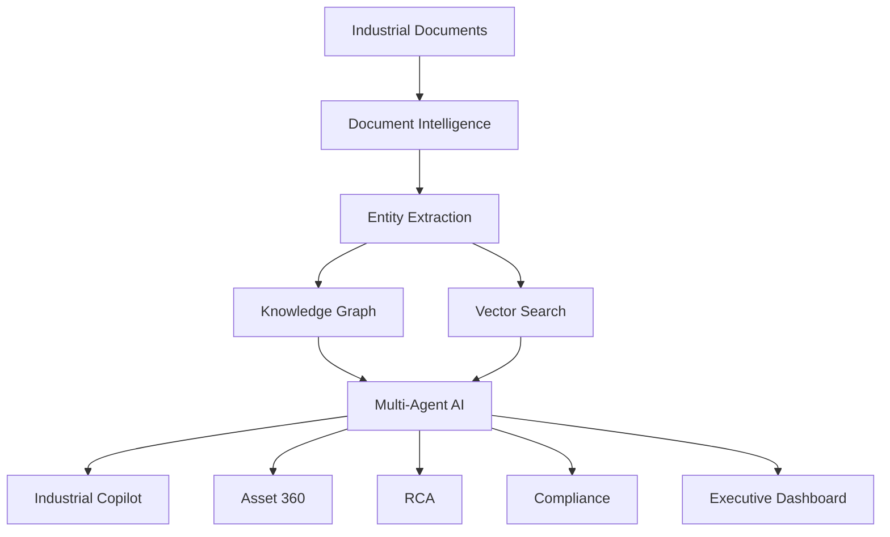

# 🏭 Industrial Brain AI
Industrial Brain AI reduces downtime, accelerates root cause analysis, improves compliance readiness, and preserves critical engineering knowledge through AI-powered operational intelligence.
<p align="center">
  
</p>

<h1 align="center">🏭 Industrial Brain AI</h1>

<h3 align="center">AI-Powered Asset & Operations Intelligence Platform</h3>

<p align="center">
  Transforming fragmented industrial documents, maintenance logs, SOPs, inspection reports, compliance records, and asset history into explainable operational intelligence.
</p>

<p align="center">
  
</p>


<p align="center">
  
  
  
  
  
</p>

---
## 🏆 ET AI Hackathon 2026 Submission

**Problem Statement #8**

## Problem Statement Alignment

**Industrial Brain AI directly addresses PS 8: AI for Industrial Knowledge Intelligence - Unified Asset & Operations Brain.**

Industrial organizations often store critical operational knowledge across disconnected maintenance logs, SOPs, inspection reports, compliance records, incident reports, and asset histories. This fragmentation delays root cause analysis, increases downtime, weakens audit readiness, and causes loss of engineering knowledge.

Industrial Brain AI solves this by creating a unified asset and operations brain that combines:

- Source-cited RAG for industrial document intelligence
- Knowledge graph mapping across assets, failures, SOPs, risks, and compliance records
- Asset 360 intelligence profiles
- Automated root cause analysis
- Compliance evidence discovery
- Lessons learned analytics
- Executive operational visibility

The platform enables plant managers, reliability engineers, maintenance teams, and auditors to make faster, safer, and evidence-backed decisions.

---
## 🤖 Why This Is Not Just a Chatbot

Industrial Brain AI is not a generic document chatbot. It is an industrial operations intelligence system designed around assets, failures, compliance, and plant workflows.

Unlike a basic chatbot, Industrial Brain AI:

- Connects every answer to source evidence
- Links documents, assets, failures, SOPs, risks, and compliance records through a knowledge graph
- Builds Asset 360 intelligence profiles
- Generates structured root cause analysis
- Identifies compliance gaps and missing evidence
- Preserves lessons learned from past failures
- Provides role-based insights for plant managers, reliability engineers, and auditors
- Refuses unsupported answers when evidence is insufficient
---
## 🚀 Overview

Industrial Brain AI is a unified Asset & Operations Intelligence Platform for manufacturing plants, refineries, steel plants, chemical facilities, power plants, and asset-intensive industrial organizations.

It provides:

- 🤖 Industrial Copilot
- 🕸 Knowledge Graph
- ⚙️ Asset 360
- ⚠️ RCA Intelligence
- 📋 Compliance Evidence
- 📊 Executive Dashboard
- 📚 Lessons Learned
- 🔎 Source-cited semantic search

## ⚡ Quick Start

### Backend

```bash
cd backend
python -m pip install -r requirements.txt
python -m uvicorn app.main:app --reload --host 127.0.0.1 --port 8000
```

### Frontend

```bash
cd frontend
pnpm install
pnpm dev
```

Open:

- Frontend: http://localhost:3000
- Backend API Docs: http://127.0.0.1:8000/docs

## 🐳 Docker

```bash
docker compose up --build
```

## 🔐 Demo Login

```text
plant.manager@industrial.ai / demo123
reliability@industrial.ai / demo123
auditor@industrial.ai / demo123
```

## 💬 Demo Questions

1. Why has Pump P101 failed repeatedly in the last six months?
2. Generate a root cause analysis for Compressor C201.
3. Which assets have overdue inspections or compliance gaps?
4. What safety risks are recurring across the plant?
5. Show the complete Asset 360 profile for Pump P101.
6. Which SOP applies to compressor overheating?
7. What lessons were learned from previous pump seal failures?
8. What evidence supports the recommended preventive action?


## 🧠 Architecture

Industrial Brain AI uses a layered intelligence architecture that combines document ingestion, entity extraction, vector search, knowledge graphs, multi-agent reasoning, and evidence-backed response generation.




<p align="center">
  <b>🏭 Industrial Brain AI</b><br/>
  Transforming Industrial Knowledge into Operational Excellence.
</p>
## 🛠 Technology Stack

### 🎨 Frontend

<p>
  
  
  
</p>

- ⚡ **Next.js 15** – Modern React framework for scalable enterprise UI
- 🔷 **TypeScript** – Type-safe frontend development
- 🎨 **Tailwind CSS** – Responsive, premium, utility-first styling

---

### ⚙️ Backend

<p>
  
  
  
  
  
</p>

- 🚀 **FastAPI** – High-performance Python API framework
- 🗄️ **SQLAlchemy** – ORM for production database models
- 🔁 **Alembic** – Database migration management
- 🔐 **JWT Authentication** – Secure token-based authentication
- 🛡️ **RBAC** – Role-based access control for enterprise users

---

### 🧠 AI Layer

<p>
  
  
  
  
  
  
</p>

- 🔎 **RAG** – Retrieval-Augmented Generation for source-grounded answers
- 🧬 **Embeddings** – Semantic document and asset search
- 🕸️ **Knowledge Graph** – Relationship mapping across assets, failures, SOPs, and regulations
- 🤖 **OpenAI-Compatible Models** – Support for OpenAI-style model APIs
- ✨ **Gemini** – Optional Google Gemini model integration
- 🧪 **Local Deterministic Mode** – Offline demo and judging-friendly AI behavior

---

### 🗄️ Data & Infrastructure

<p>
  
  
  
  
  
</p>

- 🐘 **PostgreSQL** – Relational database for assets, documents, users, permissions, and audit logs
- ⚡ **Redis** – Caching, queues, and background workflow support
- 🧠 **ChromaDB** – Vector database for embeddings and semantic retrieval
- 🐳 **Docker** – Containerized deployment
- 📦 **Docker Compose** – Multi-service local and demo environment

    
    


## 📦 Demo Data

The demo dataset includes:

- Pump P101
- Boiler B203
- Compressor C201
- Heat Exchanger HX401
- Pressure Vessel V203
- Electrical Panel EP501

### Load Demo Data

```bash
docker compose exec backend python -m app.database.seed_demo_data
```

Or via API:

```http
POST /demo/seed
```

The dataset automatically loads realistic:

- Asset Registers
- Maintenance Work Orders
- Inspection Reports
- SOPs
- Incident Reports
- Compliance Records
- Failure History
- Safety Documentation

for demonstration, evaluation, and hackathon judging.
## 📁 Folder Structure

```text
backend/
  app/
    api/
    agents/
    core/
    database/
    models/
    rag/
    schemas/
    services/
    utils/
    workers/
  alembic/

frontend/
  app/
  components/
  hooks/
  lib/
  services/
  store/
  types/

docs/
sample_data/
demo-data/
```

### 🧠 Backend

| Folder | Purpose |
|---|---|
| `backend/app/api/` | FastAPI routes for auth, ingestion, dashboard, copilot, RCA, compliance, assets, graph, and evaluation |
| `backend/app/agents/` | Multi-agent AI system for document intelligence, maintenance, compliance, RCA, knowledge graph, lessons learned, and executive insights |
| `backend/app/core/` | Configuration, security, JWT authentication, RBAC helpers, and shared settings |
| `backend/app/database/` | Database connection, session management, seed data, and demo dataset loading |
| `backend/app/models/` | SQLAlchemy models for users, assets, documents, entities, audit logs, permissions, RCA, and compliance |
| `backend/app/rag/` | RAG pipeline, embeddings, vector search, retrievers, citations, and AI provider abstraction |
| `backend/app/schemas/` | Pydantic request and response schemas |
| `backend/app/services/` | Business logic for ingestion, extraction, graph, copilot, maintenance, compliance, RCA, reports, and audit logs |
| `backend/app/utils/` | Helpers for file parsing, text cleaning, ID generation, logging, and formatting |
| `backend/app/workers/` | Background workers for document processing, embeddings, graph updates, reports, and scheduled checks |
| `backend/alembic/` | Alembic migrations for PostgreSQL schema versioning |

### 🎨 Frontend

| Folder | Purpose |
|---|---|
| `frontend/app/` | Next.js pages for dashboard, ingestion, entities, graph, copilot, asset 360, RCA, compliance, lessons, and evaluation |
| `frontend/components/` | Reusable UI components such as cards, charts, tables, navigation, upload panels, graph views, and modals |
| `frontend/hooks/` | Custom React hooks for API calls, authentication, uploads, graph data, filters, and dashboard state |
| `frontend/lib/` | API client, constants, formatting helpers, auth helpers, and shared configuration |
| `frontend/services/` | Frontend service functions for backend communication |
| `frontend/store/` | Global state for user session, filters, selected asset, selected document, and UI state |
| `frontend/types/` | TypeScript types for assets, documents, users, entities, graph nodes, copilot responses, RCA, and compliance |

### 📚 Documentation & Data

| Folder | Purpose |
|---|---|
| `docs/` | Architecture, API documentation, deployment guide, demo script, pitch materials, roadmap, and hackathon documentation |
| `sample_data/` | Small sample files for ingestion and extraction testing |
| `demo-data/` | Realistic industrial dataset with asset registers, maintenance logs, inspection reports, SOPs, incidents, safety checklists, manuals, and compliance records |

## 📈 Business Impact

| Impact Area | Improvement |
|---|---:|
| 🔍 Investigation Time | 70% Faster |
| 🧠 Knowledge Search | 90% Faster |
| 📋 Compliance Readiness | 60% Higher |
| 📊 Operational Visibility | 80% Improved |
| ⚙️ RCA Generation | 70% Faster |
| 🛡️ Audit Evidence Discovery | 60% Faster |

### Key Outcomes

- ✅ Faster root cause analysis
- ✅ Reduced downtime
- ✅ Improved audit readiness
- ✅ Better asset reliability
- ✅ Source-cited decision support
- ✅ Higher engineering productivity
## 🏆 Hackathon Advantages

| Advantage | How Industrial Brain AI Stands Out |
|---|---|
| 🧠 Innovation | Combines RAG, knowledge graphs, RCA automation, compliance intelligence, and lessons learned analytics |
| 🎯 Problem Fit | Directly solves PS 8 by creating a unified asset and operations brain |
| ⚙️ Technical Depth | Full-stack implementation with FastAPI, Next.js, vector search, RBAC, AI agents, and graph intelligence |
| 📈 Practical Impact | Reduces downtime, accelerates RCA, improves audit readiness, and preserves industrial knowledge |
| 🔎 Explainability | Every AI response is source-cited and evidence-backed |
| 🚀 Scalability | Designed for multi-plant, multi-role, enterprise industrial environments |
| 🎥 Demo Readiness | Includes realistic industrial assets, demo data, guided questions, and live deployment |

---

## 🔮 Roadmap

- 🔗 CMMS integration with SAP PM, Maximo, and maintenance systems
- 📡 SCADA and IoT sensor data integration
- 📈 Predictive failure risk scoring
- 🏭 Digital twin integration for asset simulation
- 🕸️ Plant-level and enterprise-level knowledge graphs
- 🧠 Fine-tuned industrial language models
- 📱 Mobile field engineer assistant
- 🎙️ Voice-based maintenance copilot
- 📋 Automated audit report generation
- ⚡ Real-time anomaly and risk intelligence

## 🌟 Vision

Industrial Brain AI aims to become the trusted intelligence layer for industrial operations, helping plants convert fragmented operational knowledge into safer decisions, faster investigations, stronger compliance, and measurable reliability improvement.

## 🛡 Safety Behavior

Industrial Brain AI does not answer operational, safety, or compliance questions without source evidence.

If retrieval confidence is weak, the system responds transparently and recommends uploading missing evidence.

---

<p align="center">
  <b>🏭 Industrial Brain AI</b><br/>
  Building the Future of Industrial Intelligence
</p>

<p align="center">
  ⭐ Transforming Industrial Knowledge into Operational Excellence ⭐
</p>

<br>

## 🎥 Product Demonstration

A 3.5-minute demo video is included in this repository.

[▶ Watch Demo Video](docs/demo.mp4)

The demo covers:
- Executive Command Dashboard
- Industrial AI Copilot
- Document Ingestion Center
- Knowledge Graph Explorer
- Entity Intelligence
- Asset 360
- RCA Assistant
- Compliance Intelligence
- Lessons Learned Engine

---

## 🌐 Live Demo
🚀 Application: https://intelligence-brain.onrender.com

---

## 👥 Team

**Team Name:** janicebenita123  
**Submission:** ET AI Hackathon 2026  
**Problem Statement:** #8 – AI for Industrial Knowledge Intelligence: Unified Asset & Operations Brain
