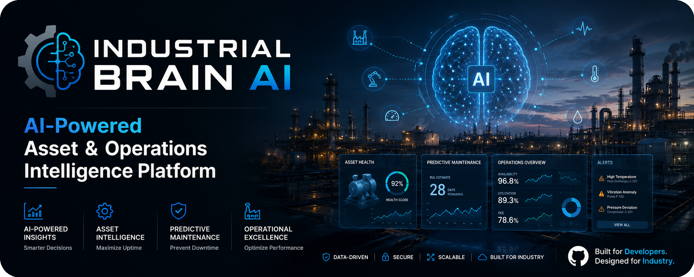
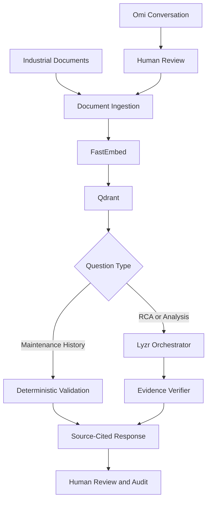

<p align="center">
  
</p>

<h1 align="center">🏭 Industrial Brain AI</h1>

<h3 align="center">
  AI-Powered Asset & Operations Intelligence Platform
</h3>

<p align="center">
  Transforming fragmented industrial documents, maintenance records,
  inspection reports, SOPs and operational conversations into
  source-cited, explainable and human-governed intelligence.
</p>

<p align="center">
  
</p>

<p align="center">
  <a href="https://intelligence-brain.onrender.com/">
    
  </a>
  <a href="https://intelligence-brain.onrender.com/login">
    
  </a>
  <a href="https://youtu.be/X0sTBuB7ifA">
    
  </a>
  <a href="https://github.com/Janicebenita/AI-powered-Industrial-Knowledge-Intelligence">
    
  </a>
</p>

<p align="center">
  
  
  
  
</p>

<p align="center">
  
  
  
  
  
  
</p>

---

## 🚀 Production Status

**Industrial Brain AI is deployed and operational.**

| Item | Status |
|---|---|
| Production application | [Live on Render](https://intelligence-brain.onrender.com/) |
| Demo login | [Open login page](https://intelligence-brain.onrender.com/login) |
| Omi | Authenticated conversation integration |
| Qdrant | Healthy and serving scoped retrieval |
| Lyzr | Orchestrator and independent verifier configured |
| Embeddings | FastEmbed — `BAAI/bge-small-en-v1.5` |
| Vector dimensions | 384 |
| Distance metric | Cosine |
| Qdrant evidence points | 354 |
| Readiness | HTTP 200 / ready |
| Human review | Mandatory |
| Automatic production deployment | Disabled |

> The platform is designed for evidence-supported engineering review. It does not independently authorize maintenance, safety-critical, compliance or corrective work.

---

## 🔐 Demo Access

- **Login:** [https://intelligence-brain.onrender.com/login](https://intelligence-brain.onrender.com/login)
- **Username:** `plant-a-demo-fca43f4fa143@example.test`
- **Role:** Restricted Plant A Operator
- **Password:** Provided privately through the request
### Recommended demonstration query

```text
Show maintenance history of P101
```

This deterministic query retrieves validated maintenance records without invoking Lyzr inference.

### AI-assisted RCA query

```text
Why has Pump P101 failed repeatedly?
```

The RCA query invokes the configured Lyzr analysis and verification workflow. Results remain subject to citation validation and human review.

---

## 🧠 What is Industrial Brain AI?

Industrial Brain AI is an industrial knowledge and operations intelligence platform that connects fragmented engineering information across:

- Maintenance work orders
- Inspection reports
- Equipment manuals
- Standard operating procedures
- Safety and isolation instructions
- Compliance documents
- Incident and near-miss reports
- Engineering notes
- Asset histories
- Approved Omi operational conversations

The platform converts this evidence into searchable, source-cited operational intelligence while preserving access control, provenance, uncertainty and human authority.

---

## 🎯 Problem

Industrial organizations often store critical knowledge across disconnected documents, spreadsheets, maintenance systems, inspection records and informal conversations.

This creates several operational problems:

- Engineers spend excessive time searching for relevant evidence.
- Previous maintenance decisions are difficult to reconstruct.
- Repeated failures are investigated without complete context.
- Important frontline knowledge is lost during shift or personnel changes.
- Compliance evidence is difficult to locate during audits.
- AI-generated conclusions may be presented without reliable citations.
- Access restrictions are difficult to enforce consistently across evidence sources.

Industrial Brain AI addresses these challenges through governed ingestion, semantic retrieval, deterministic record validation and evidence-verified AI analysis.

---

## 💡 Solution

Industrial Brain AI provides a unified interface for:

- Asking evidence-grounded industrial questions
- Retrieving asset-specific maintenance history
- Investigating repeated equipment failures
- Connecting assets, documents, failures and procedures
- Reviewing operational observations captured through Omi
- Retrieving SOP and compliance evidence
- Producing cited RCA hypotheses
- Preserving provenance and audit trails
- Enforcing plant, tenant and role-based access
- Requiring authorized human review before operational action

---

## ✨ Core Capabilities

### 🗣️ Voice-First Operational Capture

Omi provides a conversational capture layer for operational observations.

A simulated Pump P101 inspection conversation was:

1. Captured in Omi
2. Retrieved through the authenticated Omi API
3. Imported with conversation and segment provenance
4. Normalized to asset `P101`
5. Assigned to `industrial-brain-ai / plant-a`
6. Submitted for authorized human review
7. Approved as demonstration evidence
8. Embedded and indexed in Qdrant

The original transcript and operational disclaimer were preserved.

No Omi conversation automatically authorizes maintenance work or creates operational approval.

### 🔎 Semantic Evidence Retrieval

Qdrant provides scoped semantic retrieval across industrial evidence.

Each indexed chunk includes metadata such as:

- Organization
- Plant
- Asset tag
- Document type
- Permission scope
- Source filename
- Content hash
- Ingestion version
- Demonstration classification
- Operational-authorization status
- Provenance information

FastEmbed generates 384-dimensional vectors using:

```text
BAAI/bge-small-en-v1.5
```

The production Qdrant collection contains **354 evidence points**.

### 📋 Deterministic Maintenance History

Exact maintenance-history questions bypass generative rewriting.

For example:

```text
Show maintenance history of P101
```

The application:

1. Retrieves scoped Qdrant evidence
2. Identifies maintenance CSV passages
3. Parses individual work-order rows
4. Rejects malformed or truncated rows independently
5. Validates asset, date and work-order fields
6. Verifies source citations and content hashes
7. Removes deterministic duplicates
8. Sorts accepted records chronologically
9. Returns retrieved maintenance history
10. Preserves audit evidence and mandatory human review

Verified records include:

| Work order | Asset | Date |
|---|---|---|
| WO-10421 | P101 | 2025-08-14 |
| WO-10877 | P101 | 2026-02-19 |

The application labels this result **“Retrieved maintenance history”** because completeness of the total source corpus is not automatically asserted.

### 🤖 Evidence-Grounded RCA

Lyzr provides the AI analysis layer through two configured agents:

- **Industrial Evidence Orchestrator**
- **Industrial Evidence Verifier**

The orchestrator drafts evidence-grounded facts and hypotheses using retrieved passages.

The verifier independently checks:

- Claim support
- Citation identifiers
- Supporting excerpts
- Unsupported mechanisms
- Causal-ranking language
- Partial-support cases
- Missing evidence

Unsupported claims are rejected before presentation.

### 🧾 Citation and Provenance Validation

Released evidence includes:

- Stable citation ID
- Document ID
- Source filename
- Source section
- Page number when available
- Exact source passage
- Content hash
- Ingestion version
- Evidence classification
- Omi conversation provenance when applicable

The platform distinguishes:

- Confirmed source facts
- AI-generated hypotheses
- Unsupported claims
- Missing evidence
- Demonstration evidence
- Operational authorization

### 👥 Role-Based Access Control

The integration APIs use authenticated, scoped sessions.

Access decisions include:

- Authenticated user
- Server-authorized role
- Organization
- Plant
- Evidence permission scope
- Review authority

The visible “Demo persona” is separated from actual backend permissions and cannot grant access.

The restricted hackathon account uses:

```text
Role: operator
Organization: industrial-brain-ai
Plant: plant-a
```

The operator cannot approve reviewed observations or obtain administrative permissions.

### 🛡️ Human-Governed Intelligence

Industrial Brain AI follows a fail-closed design.

- Confidence is not presented as calibrated when calibration is unavailable.
- Unsupported claims are removed.
- Missing citations cause rejection.
- Operational recommendations require human review.
- Demonstration evidence is clearly labelled.
- AI does not approve maintenance or safety-critical actions.
- All important execution and review events are audited.

---

## 🏗️ Architecture


```mermaid
flowchart TD
    A[Industrial Documents] --> B[Document Ingestion]
    O[Omi Conversation] --> R[Human Review]
    R --> B
    B --> C[FastEmbed]
    C --> Q[Qdrant]
    Q --> D{Question Type}
    D -->|Maintenance History| H[Deterministic Validation]
    D -->|RCA or Analysis| L[Lyzr Orchestrator]
    L --> V[Evidence Verifier]
    H --> G[Source-Cited Response]
    V --> G
    G --> U[Human Review and Audit]
```

### Execution paths

#### Deterministic history path

```text
Authenticated Question
→ Scoped Qdrant Retrieval
→ Row-Level CSV Extraction
→ Exact Field Validation
→ Citation and Provenance Verification
→ Chronological Records
→ Human Review
```

#### AI analysis path

```text
Authenticated Question
→ Scoped Qdrant Retrieval
→ Lyzr Evidence Orchestrator
→ Independent Evidence Verifier
→ Local Citation Validation
→ Supported Facts and Hypotheses
→ Human Review
```

#### Omi evidence path

```text
Omi Conversation
→ Authenticated Import
→ Pending Observation
→ Authorized Review
→ FastEmbed
→ Qdrant
→ Scoped Retrieval
```

---

## 🧩 Platform Modules

Industrial Brain AI includes:

- Executive Cockpit
- Knowledge Copilot
- Engineering Documents
- Knowledge Graph
- Entity Intelligence
- Digital Twin
- Maintenance AI
- Root Cause Analysis
- Compliance Operations
- Lessons Learned
- Reports
- Evidence Metrics
- Integration Administration
- Asset 360 views
- Provider health and readiness monitoring

Some dashboard and asset views use clearly labelled demonstration data.

---

## 🛠️ Technology Stack

### Frontend

<p>
  
  
  
</p>

- Next.js 15
- React
- TypeScript
- Tailwind CSS
- Responsive enterprise interface

### Server and APIs

<p>
  
  
  
  
</p>

- Server-side TypeScript integration APIs
- Authenticated session handling
- HttpOnly and Secure cookies
- Tenant, plant and role-based authorization
- Audit logging
- Original FastAPI prototype APIs

### AI and Retrieval

<p>
  
  
  
  
</p>

- Omi conversation integration
- FastEmbed semantic embeddings
- Qdrant vector storage and retrieval
- Lyzr direct-agent execution
- Independent evidence verification
- Deterministic maintenance-history extraction
- Citation and provenance validation
- Human-governed decision controls

### Infrastructure

<p>
  
  
  
</p>

- Docker container deployment
- Render production hosting
- GitHub Actions CI
- Readiness and provider-health endpoints

---

## 📊 Verified Production Evidence

| Verification | Result |
|---|---|
| Production readiness | Passed |
| Provider health | Passed |
| Qdrant collection count | 354 |
| Embedding dimensions | 384 |
| Deterministic P101 maintenance retrieval | Passed |
| WO-10421 citation validation | Passed |
| WO-10877 citation validation | Passed |
| Chronological ordering | Passed |
| Truncated-row isolation | Passed |
| RBAC enforcement | Passed |
| Login and logout | Passed |
| Session restoration | Passed |
| Secure cookies | Passed |
| Sanitized evidence export | Passed |
| Audit logging | Passed |
| Human-review requirement | Passed |
| Unexpected Qdrant writes | None |
| OOM during final acceptance | None observed |

---

## 🧪 Evidence Dataset

The demonstration corpus contains industrial-style evidence including:

- Pump P101 manual
- Maintenance work orders
- Inspection report
- Engineering notes
- Pump-isolation SOP
- LOTO procedure
- Compliance requirements
- QA/QC manual extract
- Incident records
- Near-miss report
- Asset register
- NCR evidence
- Approved simulated Omi observation

The dataset is intended for demonstration and evaluation. It must not be interpreted as authorization for real plant operations.

---

## 🩺 Health Endpoints

| Endpoint | Purpose |
|---|---|
| `/api/health` | Combined diagnostic provider status |
| `/api/health/omi` | Omi authenticated read probe |
| `/api/health/qdrant` | Qdrant connectivity probe |
| `/api/health/lyzr` | Lyzr agent health probe |
| `/api/readiness` | Production readiness gate |

Example:

```text
https://intelligence-brain.onrender.com/api/readiness
```

---

## 💻 Local Development

### Requirements

- Node.js 22
- pnpm
- Python 3.11+ for the optional FastAPI prototype
- Docker for container verification
- Provider credentials only when testing live integrations

### Start the Next.js application

```bash
cd frontend
pnpm install --frozen-lockfile
pnpm build
pnpm start
```

Open:

```text
http://localhost:3000
```

### Start the optional FastAPI prototype

```bash
cd backend
python -m pip install -r requirements.txt
python -m uvicorn app.main:app --host 127.0.0.1 --port 8000
```

---

## ⚙️ Environment Configuration

Use `.env.example` as the variable-name reference.

Never commit real credentials.

```env
ENVIRONMENT=production
APP_BASE_URL=https://your-application.example

VOICE_PROVIDER=omi
VECTOR_PROVIDER=qdrant
AGENT_PROVIDER=lyzr
ALLOW_DEMO_FALLBACK=false

OMI_API_KEY=your_private_key

QDRANT_URL=https://your-cluster.example:6333
QDRANT_API_KEY=your_private_key
QDRANT_COLLECTION=industrial_brain_evidence_v1
QDRANT_MIGRATION_VERIFIED=true

EMBEDDING_PROVIDER=fastembed
EMBEDDING_MODEL=BAAI/bge-small-en-v1.5
EMBEDDING_DIMENSION=384

LYZR_API_BASE_URL=https://agent-prod.studio.lyzr.ai
LYZR_API_MODE=agent
LYZR_API_KEY=your_private_key
LYZR_AGENT_ID=your_orchestrator_agent_id
LYZR_VERIFIER_AGENT_ID=your_verifier_agent_id
LYZR_WORKFLOW_ID=

JWT_SECRET=your_private_random_secret
INTEGRATION_USERS_JSON=your_private_user_configuration
```

Do not place provider keys or user passwords in README files, screenshots, issues or commits.

---

## 🗂️ Repository Structure

```text
.
├── backend/                 # Original FastAPI prototype
├── demo-data/               # Demonstration evidence
├── docs/                    # Architecture, security and reports
├── frontend/                # Next.js production application
│   ├── app/                 # Pages and API routes
│   ├── components/          # Interface components
│   ├── lib/                 # Integration and validation logic
│   └── scripts/             # Migration and verification utilities
├── mobile/                  # Expo mobile prototype
├── Dockerfile               # Production container
├── docker-compose.yml       # Local multi-service configuration
└── README.md
```

---

## ✅ Testing

From `frontend`:

```bash
pnpm lint
pnpm typecheck
pnpm test
pnpm build
```

Testing includes:

- Authentication and session restoration
- Login and logout auditing
- Secure cookie behavior
- Tenant, plant and role-based access
- Omi import and duplicate prevention
- Qdrant retrieval contracts
- Lyzr adapter contracts
- Independent verifier responses
- Citation and excerpt validation
- Deterministic maintenance-history extraction
- CSV row isolation
- Conflict and malformed-record handling
- Evidence export sanitization
- Responsive component checks
- FastEmbed vector validation
- Legacy evidence regression

Mocked tests are not presented as proof of live provider availability. Production readiness uses authenticated runtime checks.

---

## 🎬 Suggested Demonstration Flow

1. Open the [production login page](https://intelligence-brain.onrender.com/login).
2. Sign in using the restricted demo operator account.
3. Open **Knowledge Copilot**.
4. Ask:

   ```text
   Show maintenance history of P101
   ```

5. Demonstrate both dated work orders and their citations.
6. Open the connected source evidence.
7. Show provenance and chronological ordering.
8. Explain that malformed unrelated rows are rejected independently.
9. Show that confidence is not presented as calibrated.
10. Highlight mandatory human review.
11. Optionally demonstrate the RCA workflow once.
12. Sign out and show session invalidation.

---

## 🔒 Security and Governance

Industrial Brain AI includes:

- Authenticated integration sessions
- HttpOnly cookies
- Secure HTTPS cookie handling
- SameSite cookie protection
- Eight-hour session expiry
- Role-based access control
- Tenant and plant isolation
- Restricted demonstration account
- Source-content hashing
- Versioned evidence ingestion
- Citation verification
- Human-review controls
- Audit events
- Sanitized evidence export
- Fail-closed validation

The demonstration operator cannot approve evidence, administer integrations, run migrations or configure providers.

---

## ⚠️ Limitations

- The Render Free instance has constrained memory and may sleep when inactive.
- First startup may take longer while FastEmbed initializes.
- The filesystem is temporary and is not suitable for durable production audit storage.
- Current integration state is designed for a single application instance.
- Omi import and review are manually governed.
- Lyzr output can vary and is therefore validated before release.
- Model confidence is not calibrated.
- “Retrieved maintenance history” does not guarantee completeness of every possible external record.
- Some dashboards use labelled demonstration data.
- AI output does not replace authorized engineering judgment.

---

## 🛣️ Roadmap

Planned future improvements include:

- Durable PostgreSQL-backed integration and audit storage
- Background ingestion workers
- Expanded multi-plant tenancy
- Enterprise identity-provider integration
- Stronger rate limiting for public demonstrations
- Native maintenance-system connectors
- Additional Omi review workflows
- Hybrid semantic and keyword retrieval
- Knowledge-graph enrichment
- Calibrated retrieval-quality metrics
- Agent-execution cost monitoring
- Automated backup and disaster recovery
- Horizontal scaling
- Advanced Asset 360 analytics

---

## 🌍 Potential Applications

Industrial Brain AI can support:

- Manufacturing plants
- Power and utilities
- Oil and gas facilities
- Water-treatment plants
- Construction and infrastructure
- Railway asset management
- Mining and mineral processing
- Pharmaceutical manufacturing
- Industrial quality assurance
- Safety and compliance operations

---

## 🏆 Hackathon Submission

**Project:** Industrial Brain AI — AI-Powered Asset & Operations Intelligence Platform  
**Track:** Open Innovation  
**Repository:** [GitHub](https://github.com/Janicebenita/AI-powered-Industrial-Knowledge-Intelligence)  
**Live application:** [Render](https://intelligence-brain.onrender.com/)  
**Demo video:** [YouTube](https://youtu.be/08Qul_nH7-s)

### Omi

Omi serves as the voice-first operational capture layer. A simulated Pump P101 inspection conversation was imported with full conversation and segment provenance, reviewed by an authorized user and indexed as demonstration evidence.

### Qdrant

Qdrant provides scoped semantic retrieval over 354 evidence points using 384-dimensional FastEmbed vectors and cosine similarity. Asset, plant, document, permission and provenance metadata are preserved.

### Lyzr

Lyzr provides evidence-grounded analysis through an Industrial Evidence Orchestrator and an independent Industrial Evidence Verifier. Unsupported claims are rejected, and all operational conclusions require human review.

---

## 📚 Documentation

- [Integration architecture](docs/INTEGRATION_ARCHITECTURE.md)
- [Lyzr workflow contract](docs/LYZR_WORKFLOW.md)
- [Deployment guide](docs/DEPLOYMENT.md)
- [Security limitations](docs/SECURITY.md)
- [Rollback procedure](docs/ROLLBACK.md)
- [Demo runbook](docs/DEMO_RUNBOOK.md)
- [Test report](docs/TEST_REPORT.md)
- [Baseline audit](docs/BASELINE_AUDIT.md)

---

## 👩‍💻 Author

**Janice Benita F**

- GitHub: [@Janicebenita](https://github.com/Janicebenita)
- LinkedIn: [linkedin.com/in/janice13](https://www.linkedin.com/in/janice13)
- Portfolio: [janice-portfolio-delta.vercel.app](https://janice-portfolio-delta.vercel.app)

---

## 📄 Disclaimer

Industrial Brain AI is a demonstration and research platform.

All operational observations, maintenance records, inspection findings, recommendations and AI-generated outputs must be reviewed by appropriately authorized personnel before use.

The system supports engineering judgment—it does not replace it.

<p align="center">
  <b>🏭 Industrial Brain AI</b><br/>
  Transforming Industrial Knowledge into Operational Excellence.
</p>
