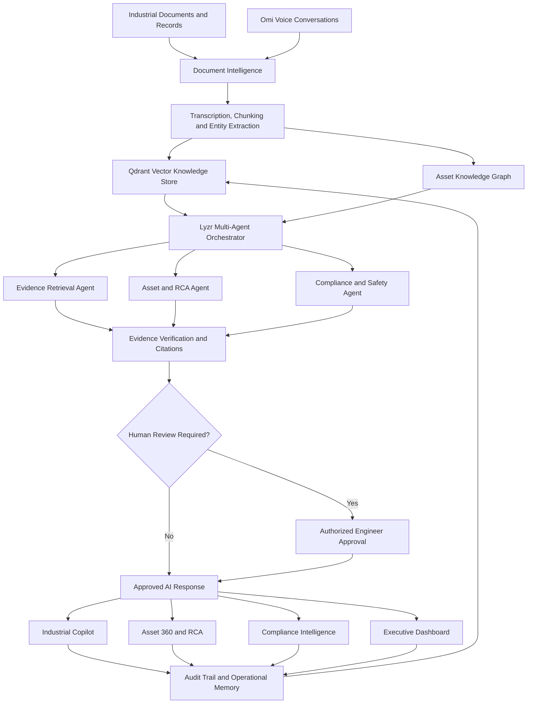
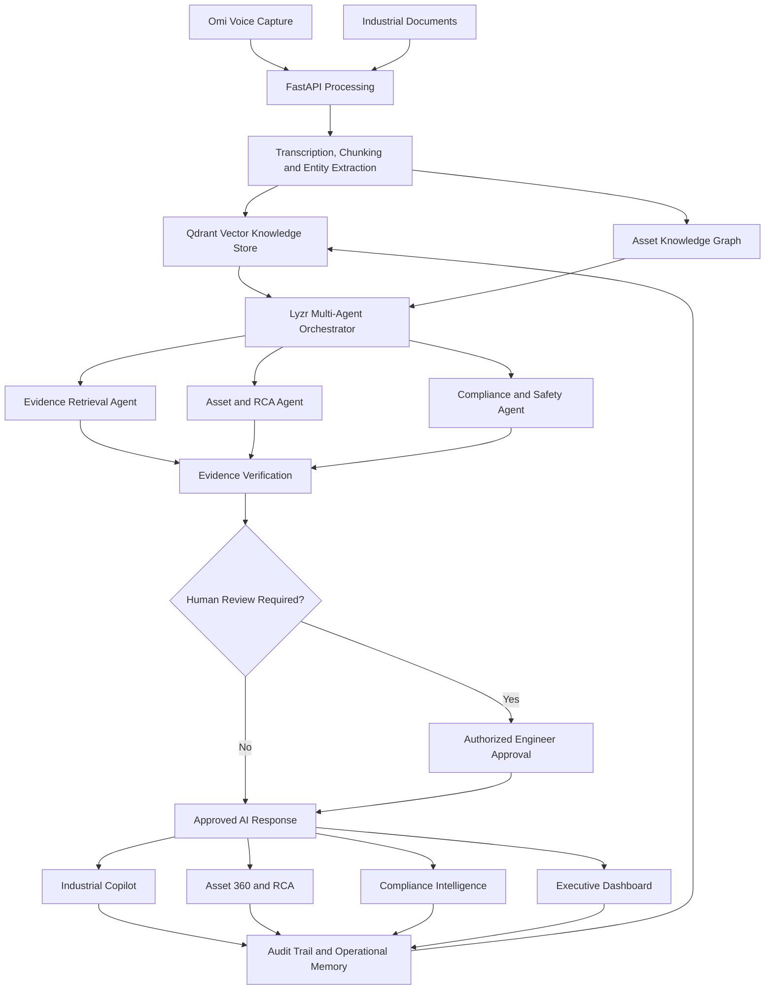

# 🏭 Industrial Brain AI
Industrial Brain AI reduces downtime, accelerates root cause analysis, improves compliance readiness, and preserves critical engineering knowledge through AI-powered operational intelligence.
<p align="center">
  
</p>

<h1 align="center">🏭 Industrial Brain AI</h1>

<h3 align="center">AI-Powered Asset & Operations Intelligence Platform</h3>

<p align="center">
  Transforming fragmented industrial documents, maintenance logs, SOPs, inspection reports, compliance records, and asset history into explainable operational intelligence.
</p>

<p align="center">
  
</p>


<p align="center">
  
  
  
  
  
</p>

---
## 🏆 AI Hackathon 2026 Submission

**Open Innovation Track**

**AI for Industrial Knowledge Intelligence: Unified Asset & Operations Brain**

Industrial Brain AI addresses the challenge of fragmented industrial knowledge by unifying engineering documents, maintenance records, inspection reports, SOPs, compliance evidence, and operational history into a single AI-powered intelligence platform featuring Knowledge Graphs, RAG-based Copilot, Asset Intelligence, RCA Automation, Compliance Intelligence, and Lessons Learned Analytics.

---
## 🚀 Overview

Industrial Brain AI is a unified Asset & Operations Intelligence Platform for manufacturing plants, refineries, steel plants, chemical facilities, power plants, and asset-intensive industrial organizations.

It provides:

- 🤖 Industrial Copilot
- 🕸 Knowledge Graph
- ⚙️ Asset 360
- ⚠️ RCA Intelligence
- 📋 Compliance Evidence
- 📊 Executive Dashboard
- 📚 Lessons Learned
- 🔎 Source-cited semantic search

## ⚡ Quick Start

### Backend

```bash
cd backend
python -m pip install -r requirements.txt
python -m uvicorn app.main:app --reload --host 127.0.0.1 --port 8000
```

### Frontend

```bash
cd frontend
pnpm install
pnpm dev
```

Open:

- Frontend: http://localhost:3000
- Backend API Docs: http://127.0.0.1:8000/docs

## 🐳 Docker

```bash
docker compose up --build
```

## 🔐 Demo Login

```text
plant.manager@industrial.ai / demo123
reliability@industrial.ai / demo123
auditor@industrial.ai / demo123
```

## 💬 Demo Questions

```text
Why has Pump P101 failed repeatedly?
Show complete maintenance history of Pump P101.
Which assets have overdue inspections?
Generate RCA for Compressor C201.
What recurring safety risks exist in the plant?
```

## 🧠 Architecture


```mermaid
flowchart TD
    A["Industrial Documents and Records"] --> C["Document Intelligence"]
    B["Omi Voice Conversations"] --> C

    C --> D["Transcription, Chunking and Entity Extraction"]
    D --> E["Qdrant Vector Knowledge Store"]
    D --> F["Asset Knowledge Graph"]

    E --> G["Lyzr Multi-Agent Orchestrator"]
    F --> G

    G --> H["Evidence Retrieval Agent"]
    G --> I["Asset and RCA Agent"]
    G --> J["Compliance and Safety Agent"]

    H --> K["Evidence Verification and Citations"]
    I --> K
    J --> K

    K --> L{"Human Review Required?"}
    L -->|Yes| M["Authorized Engineer Approval"]
    L -->|No| N["Approved AI Response"]
    M --> N

    N --> O["Industrial Copilot"]
    N --> P["Asset 360 and RCA"]
    N --> Q["Compliance Intelligence"]
    N --> R["Executive Dashboard"]

    O --> S["Audit Trail and Operational Memory"]
    P --> S
    Q --> S
    R --> S

    S --> E
```

### 🔄 Unified Agentic Execution Loop

1. **Omi** captures voice-based inspections, maintenance observations, shift handovers and engineering discussions.
2. **Document Intelligence** processes uploaded documents and Omi conversations into structured, searchable knowledge.
3. **Qdrant** stores embedded evidence with metadata such as plant, asset tag, document type, date and access role.
4. **Lyzr** orchestrates specialist agents for evidence retrieval, asset investigation, root-cause analysis, compliance and safety.
5. **Evidence verification** checks whether every important conclusion is supported by retrieved source records.
6. **Human approval** governs high-impact maintenance, RCA, compliance and safety recommendations.
7. Approved outputs are delivered through the Industrial Copilot, Asset 360, RCA, Compliance Intelligence and Executive Dashboard.
8. The resulting audit records and validated operational knowledge are returned to the searchable memory layer.

<p align="center">
  <b>🏭 Industrial Brain AI</b><br/>
  Voice-first, memory-backed industrial intelligence powered by Omi, Qdrant and Lyzr.<br/>
  Transforming fragmented operational knowledge into governed, evidence-grounded action.
</p>

## 🛠 Technology Stack


### 🎨 Frontend

<p>
  
  
  
</p>

- ⚡ **Next.js 15** – Enterprise web interface for the Industrial Copilot, Asset 360, RCA and compliance workflows
- 🔷 **TypeScript** – Type-safe application development
- 🎨 **Tailwind CSS** – Responsive industrial command-centre interface

---

### ⚙️ Backend and Security

<p>
  
  
  
  
  
</p>

- 🚀 **FastAPI** – API layer connecting the user interface, industrial data and agent workflows
- 🗄️ **SQLAlchemy** – ORM for structured industrial and application data
- 🔁 **Alembic** – Controlled database schema migrations
- 🔐 **JWT Authentication** – Secure token-based authentication
- 🛡️ **RBAC** – Role-based access to plant, asset, compliance and administrative functions
- 👤 **Human Governance** – Authorized engineering review for high-impact AI recommendations

---

### 🎙️ Omi Voice and Operational Memory

<p>
  
  
  
</p>

- 🎙️ **Omi** – Voice-first capture of maintenance observations, inspection findings, troubleshooting discussions and shift handovers
- 📝 **Conversation Processing** – Converts engineering discussions into structured operational context
- ✅ **Action-Item Capture** – Preserves follow-up activities identified during field conversations
- 🧠 **Operational Continuity** – Makes captured knowledge available to future investigations and agent workflows

---

### 🤖 Lyzr Agentic AI and Orchestration

<p>
  
  
  
  
</p>

- 🧩 **Lyzr** – Orchestrates evidence retrieval, asset intelligence, RCA, compliance and safety agents
- 🔎 **Retrieval-Augmented Generation** – Produces answers grounded in retrieved industrial evidence
- 🕸️ **Knowledge Graph** – Maps relationships among assets, failures, work orders, SOPs and risks
- 📚 **Evidence Verification** – Connects important findings and recommendations to supporting source records
- 👤 **Human-in-the-Loop Control** – Routes consequential recommendations for authorized engineering review

---

### 🔍 Qdrant Vector Retrieval and Knowledge Storage

<p>
  
  
  
</p>

- 🧠 **Qdrant** – Vector database for industrial documents, operational records and Omi-derived knowledge
- 🔎 **Semantic Retrieval** – Finds evidence by operational meaning instead of keyword matching alone
- 🏷️ **Metadata Filtering** – Restricts retrieval by plant, asset tag, document type, date, risk and access role
- 📄 **Source-Cited Evidence** – Returns relevant evidence chunks for grounded AI responses
- 🔄 **Persistent Agent Memory** – Makes validated operational knowledge available to subsequent workflows

---

### 🗄️ Data and Infrastructure

<p>
  
  
  
  
  
</p>

- 🐘 **PostgreSQL** – Structured storage for assets, documents, users, permissions and audit records
- ⚡ **Redis** – Caching, queues and temporary workflow state
- 🧠 **Qdrant** – Persistent vector retrieval and evidence-memory layer
- 🐳 **Docker** – Containerized application deployment
- 📦 **Docker Compose** – Reproducible multi-service development and demonstration environment

---

## 🔗 Omi–Qdrant–Lyzr Integration


```mermaid
flowchart TD
    A["Omi Voice Capture"] --> B["FastAPI Processing"]
    C["Industrial Documents"] --> B

    B --> D["Transcription, Chunking and Entity Extraction"]
    D --> E["Qdrant Vector Knowledge Store"]
    D --> F["Asset Knowledge Graph"]

    E --> G["Lyzr Multi-Agent Orchestrator"]
    F --> G

    G --> H["Evidence Retrieval Agent"]
    G --> I["Asset and RCA Agent"]
    G --> J["Compliance and Safety Agent"]

    H --> K["Evidence Verification"]
    I --> K
    J --> K

    K --> L{"Human Review Required?"}
    L -->|Yes| M["Authorized Engineer Approval"]
    L -->|No| N["Approved AI Response"]
    M --> N

    N --> O["Industrial Copilot"]
    N --> P["Asset 360 and RCA"]
    N --> Q["Compliance Intelligence"]
    N --> R["Executive Dashboard"]

    O --> S["Audit Trail and Operational Memory"]
    P --> S
    Q --> S
    R --> S

    S --> E
```

### 🔄 Unified Agentic Execution Loop

1. **Omi captures** frontline conversations, maintenance observations, inspections and shift handovers.
2. **FastAPI processes** Omi conversations and uploaded industrial documents.
3. **Qdrant stores and retrieves** evidence using embeddings and asset-aware metadata.
4. **Lyzr orchestrates** specialist agents for evidence retrieval, asset analysis, RCA, compliance and safety.
5. **Evidence verification** checks whether important findings are supported by retrieved source records.
6. **Human review** governs high-impact engineering and safety recommendations.
7. Approved results are delivered through the Industrial Copilot, Asset 360, RCA, Compliance Intelligence and Executive Dashboard.
8. Validated outputs are retained in the audit trail and operational-memory layer.

> **Core integration:** Omi captures operational knowledge, Qdrant preserves and retrieves evidence, and Lyzr orchestrates the agent workflow to produce governed, evidence-grounded industrial intelligence.

    
    


## 📦 Demo Data

The demo dataset includes:

- Pump P101
- Boiler B203
- Compressor C201
- Heat Exchanger HX401
- Pressure Vessel V203
- Electrical Panel EP501

### Load Demo Data

```bash
docker compose exec backend python -m app.database.seed_demo_data
```

Or via API:

```http
POST /demo/seed
```

The dataset automatically loads realistic:

- Asset Registers
- Maintenance Work Orders
- Inspection Reports
- SOPs
- Incident Reports
- Compliance Records
- Failure History
- Safety Documentation

for demonstration, evaluation, and hackathon judging.
## 📁 Folder Structure

```text
backend/
  app/
    api/
    agents/
    core/
    database/
    models/
    rag/
    schemas/
    services/
    utils/
    workers/
  alembic/

frontend/
  app/
  components/
  hooks/
  lib/
  services/
  store/
  types/

docs/
sample_data/
demo-data/
```

### 🧠 Backend

| Folder | Purpose |
|---|---|
| `backend/app/api/` | FastAPI routes for auth, ingestion, dashboard, copilot, RCA, compliance, assets, graph, and evaluation |
| `backend/app/agents/` | Multi-agent AI system for document intelligence, maintenance, compliance, RCA, knowledge graph, lessons learned, and executive insights |
| `backend/app/core/` | Configuration, security, JWT authentication, RBAC helpers, and shared settings |
| `backend/app/database/` | Database connection, session management, seed data, and demo dataset loading |
| `backend/app/models/` | SQLAlchemy models for users, assets, documents, entities, audit logs, permissions, RCA, and compliance |
| `backend/app/rag/` | RAG pipeline, embeddings, vector search, retrievers, citations, and AI provider abstraction |
| `backend/app/schemas/` | Pydantic request and response schemas |
| `backend/app/services/` | Business logic for ingestion, extraction, graph, copilot, maintenance, compliance, RCA, reports, and audit logs |
| `backend/app/utils/` | Helpers for file parsing, text cleaning, ID generation, logging, and formatting |
| `backend/app/workers/` | Background workers for document processing, embeddings, graph updates, reports, and scheduled checks |
| `backend/alembic/` | Alembic migrations for PostgreSQL schema versioning |

### 🎨 Frontend

| Folder | Purpose |
|---|---|
| `frontend/app/` | Next.js pages for dashboard, ingestion, entities, graph, copilot, asset 360, RCA, compliance, lessons, and evaluation |
| `frontend/components/` | Reusable UI components such as cards, charts, tables, navigation, upload panels, graph views, and modals |
| `frontend/hooks/` | Custom React hooks for API calls, authentication, uploads, graph data, filters, and dashboard state |
| `frontend/lib/` | API client, constants, formatting helpers, auth helpers, and shared configuration |
| `frontend/services/` | Frontend service functions for backend communication |
| `frontend/store/` | Global state for user session, filters, selected asset, selected document, and UI state |
| `frontend/types/` | TypeScript types for assets, documents, users, entities, graph nodes, copilot responses, RCA, and compliance |

### 📚 Documentation & Data

| Folder | Purpose |
|---|---|
| `docs/` | Architecture, API documentation, deployment guide, demo script, pitch materials, roadmap, and hackathon documentation |
| `sample_data/` | Small sample files for ingestion and extraction testing |
| `demo-data/` | Realistic industrial dataset with asset registers, maintenance logs, inspection reports, SOPs, incidents, safety checklists, manuals, and compliance records |

## 📈 Business Impact
| Impact Area | Improvement |
|---|---|
| 🔍 Investigation Time | 70% Faster |
| 🧠 Knowledge Search | 90% Faster |
| 📋 Compliance Readiness | 60% Higher |
| 📊 Operational Visibility | 80% Improved |

### Key Outcomes

- ✅ Faster root cause analysis
- ✅ Reduced downtime
- ✅ Improved audit readiness
- ✅ Better asset reliability
- ✅ Source-cited decision support
- ✅ Higher engineering productivity
## 🏆 Hackathon Advantages

- 🧠 Multi-agent industrial AI architecture
- 🕸 Knowledge graph powered operational intelligence
- 🔎 Source-cited explainable answers
- 📋 Compliance and audit evidence generation
- ⚠️ Root cause analysis automation
- 🏭 Realistic industrial demo dataset
- 🚀 Enterprise-ready full-stack implementation

---

## 🔮 Roadmap

- Predictive failure models
- Digital twin integration
- SAP integration
- SCADA integration
- Real-time sensor intelligence
- Industrial LLM fine-tuning
- Advanced reliability analytics
- Autonomous industrial agents

---

## 🛡 Safety Behavior

Industrial Brain AI does not answer operational, safety, or compliance questions without source evidence.

If retrieval confidence is weak, the system responds transparently and recommends uploading missing evidence.

---

<p align="center">
  <b>🏭 Industrial Brain AI</b><br/>
  Building the Future of Industrial Intelligence
</p>

<p align="center">
  ⭐ Transforming Industrial Knowledge into Operational Excellence ⭐
</p>

<br>

## 🎥 Product Demonstration

A 3.5-minute demo video is included in this repository.

[▶ Watch Demo Video](docs/demo.mp4)

The demo covers:
- Executive Command Dashboard
- Industrial AI Copilot
- Document Ingestion Center
- Knowledge Graph Explorer
- Entity Intelligence
- Asset 360
- RCA Assistant
- Compliance Intelligence
- Lessons Learned Engine

---

## 🌐 Live Demo
🚀 Application: https://intelligence-brain.onrender.com

---

## 👥 Team

**Team Name:** janicebenita123  
**Submission:** AI Hackathon 2026  
**Problem Statement:** Open Innovation Track – AI for Industrial Knowledge Intelligence: Unified Asset & Operations Brain
