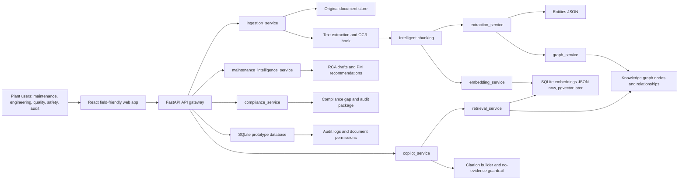

# Architecture

## Service Responsibilities

- `ingestion_service`: stores original files, extracts text, chunks content, embeds chunks, extracts entities, creates graph relationships, and records audit events.
- `extraction_service`: regex and dictionary-based industrial entity extraction. Built to be replaced by a structured LLM extractor.
- `embedding_service`: deterministic token-vector embedding for offline demo retrieval.
- `retrieval_service`: similarity search across chunks with score thresholds.
- `graph_service`: creates graph payloads for UI and asset neighborhoods.
- `copilot_service`: answer synthesis with citations and refusal when evidence is insufficient.
- `maintenance_service`: Asset 360, repeated failure detection, RCA draft reports, and PM recommendations.
- `compliance_service`: requirement-to-evidence mapping, gap detection, and audit package summaries.

## Data Model

Core tables:

- `documents`
- `chunks`
- `entities`
- `entity_relationships`
- `assets`
- `work_orders`
- `inspections`
- `failures`
- `regulations`
- `procedures`
- `chat_sessions`
- `citations`
- `audit_logs`

## Security Model

Prototype security fields are included in the data model:

- `documents.owner_role`
- `documents.permission_level`
- `audit_logs.actor`
- `audit_logs.action`
- `audit_logs.target`

Production hardening should add SSO, row-level security, signed document URLs, encryption at rest, and scoped retrieval filters.
