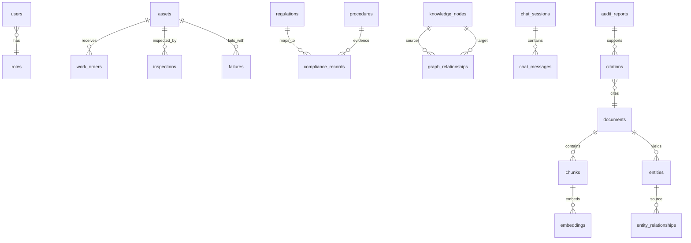

# Database Diagram

```mermaid
erDiagram
  users }o--|| roles : has
  documents ||--o{ chunks : contains
  documents ||--o{ entities : yields
  chunks ||--o{ embeddings : embeds
  entities ||--o{ entity_relationships : source
  assets ||--o{ work_orders : receives
  assets ||--o{ inspections : inspected_by
  assets ||--o{ failures : fails_with
  regulations ||--o{ compliance_records : maps_to
  procedures ||--o{ compliance_records : evidence
  knowledge_nodes ||--o{ graph_relationships : source
  knowledge_nodes ||--o{ graph_relationships : target
  chat_sessions ||--o{ chat_messages : contains
  citations }o--|| documents : cites
  audit_reports ||--o{ citations : supports
```

The production schema is defined in SQLAlchemy models under `backend/app/models` and an Alembic migration under `backend/alembic/versions`.
