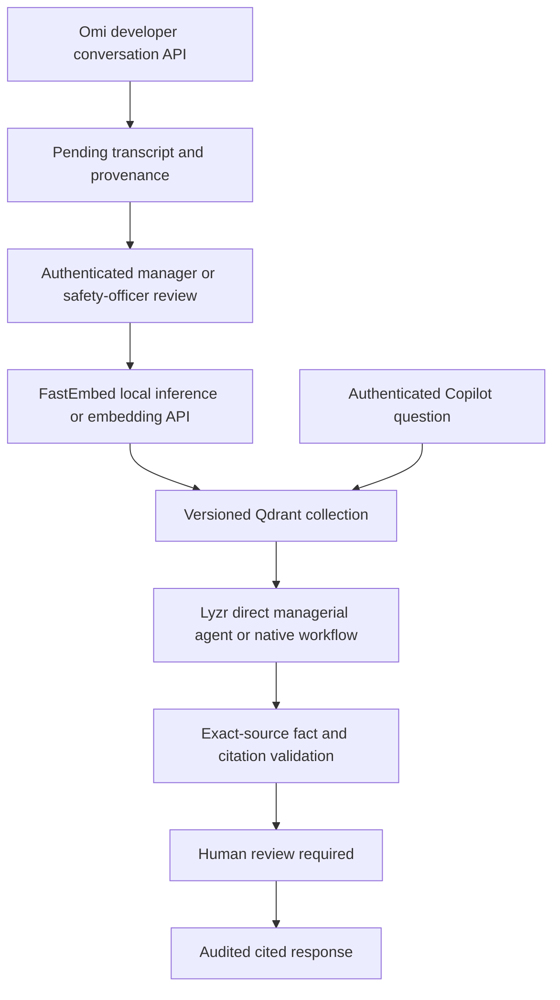

# Integration architecture

Status: implemented locally; Omi reads and Lyzr direct inference verified; Qdrant and deployed end-to-end execution remain **blocked**.

The existing Render image runs Next.js, so integration code lives in `frontend/lib/server/integrations`. It is executed server-side by Next route handlers. The separate FastAPI prototype remains available for its original endpoints and demo workflows. No Chroma/FAISS data is removed; actual legacy retrieval is Next keyword matching and Python SQLite token vectors.

## Contracts and providers

`contracts.ts` defines ConversationProvider, VectorStoreProvider, AgentOrchestratorProvider, EmbeddingProvider, AuditProvider, HealthCheckProvider, Scope, Evidence, Observation and Execution. `factory.ts` supplies HTTP adapters. Modes choose the integration path in the existing Copilot and upload routes. Local deterministic retrieval remains explicitly labelled.

Omi uses authenticated GET `/v1/dev/user/conversations` and `/v1/dev/user/conversations/{id}?include_transcript=true`. A developer account is assigned to exactly one configured tenant/plant. No personal-memory writes, microphone access or maintenance scheduling are attempted. Native action items are retained; no confidence is invented. Source IDs and content hashes prevent duplicate import. Review and indexing are separate states: an approved record can have failed indexing and be retried.

Qdrant stores one dense Cosine vector per chunk. FastEmbed supports BAAI/bge-small-en-v1.5 locally at 384 dimensions; OpenAI-compatible embeddings remain optional. IDs derive from scope, source and content. Search and deletion require tenant, plant and permission filters in the Qdrant request and validate returned scope again. PDF ingestion preserves actual pages; flat legacy text uses character sections with unknown page numbers. Original uploads are retained privately. No collection is created on startup.

Lyzr supports `LYZR_API_MODE=superflow` (default) and the documented legacy `v3` workflow endpoint. SuperFlow submits a stored workflow ID and polls the returned execution ID; v3 requires a successful synchronous output. Execution POSTs are not automatically retried because the API does not establish an idempotency guarantee. A failed or timed-out execution must be inspected before a user retries it.

In native workflow mode, six required step names are checked. The stored workflow must call the scoped retrieval endpoint and issue start/completion callbacks around real agent nodes. Displayed times are callback receipt times, not LLM-generated timestamps. Raw model reasoning and arbitrary vendor trace fields are never forwarded. Configuration and response mapping still require validation against the owner's actual Lyzr account; see LYZR_WORKFLOW.md.

## Evidence and safety

Facts must be exact source passages; paraphrases/causal hypotheses must be marked inference. Unknown citation IDs fail the execution. Citation coverage is the fraction of returned claims with valid citation IDs, not a correctness probability. Confidence is null for integrations. Every result requires human review. The review endpoint records evidence review only and never issues a work permit or authorizes equipment operation.

## Persistence and limits

Integration state is a versioned JSON store on a private persistent disk, with an exclusive interprocess lock, file fsync and atomic replacement. Audit entries form a hash chain. It supports one Render instance and small hackathon workloads, not horizontal scaling or a certified immutable audit store. A crash-held lock fails closed pending inspection. Retained originals and checkpoints permit non-destructive recovery. Back up the whole directory consistently.

Existing Python persistence/authentication is a separate prototype boundary; it is not silently represented as production enterprise security. Its remaining risks are listed in SECURITY.md.

## Primary API references

- [Omi conversations](https://docs.omi.me/api-reference/endpoint/conversations/list)
- [Omi transcript retrieval](https://docs.omi.me/api-reference/endpoint/conversations/get)
- [Qdrant filtering](https://qdrant.tech/documentation/search/filtering/)
- [Lyzr SuperFlow execution](https://docs.lyzr.ai/enterprise/api/superflow/executions/execute)
- [Lyzr execution status](https://docs.lyzr.ai/enterprise/api/superflow/executions/get)
- [Legacy Lyzr workflow execution](https://docs.lyzr.ai/agent-apis/orchestration/execute-workflow-endpoint)

## Application ownership aliases

`OMI_ORGANIZATION_ID` and `OMI_PLANT_ID` bind the external account to the application tenant and plant; organization/plant names are descriptive labels only. They are not asserted to be native Omi identifiers. Normalized observations, evidence payloads and audit events carry `organization_id` and `plant_id` alongside existing tenant/plant keys. Qdrant retrieval/deletion requires both pairs plus permission scope. Existing payloads without these aliases require reindexing; payload-v2 migration checkpoints prevent an old checkpoint from skipping the update.

## FastEmbed runtime

The official Python FastEmbed package runs behind a private stdin/stdout bridge, with no listener. A bounded single worker per Node process uses a pre-initialized local model cache; inference is offline, external credentials are not inherited, invalid vectors fail closed. Docker uses Debian/glibc, Python venv and builds the public model cache into the image. Container memory/performance still require Render verification. See FASTEMBED.md.
