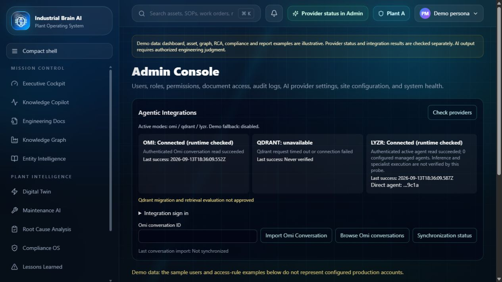

# Live provider checks — 2026-09-14 (Asia/Kolkata)

Credentials are stored only in an ignored local provider environment file; no values or private endpoints appear here. This report supersedes the earlier no-credentials status, not the outstanding production acceptance checks.

| Check | Actual result |
|---|---|
| Omi developer conversation list | Authenticated HTTP 200, expected array response |
| Omi application health endpoint | HTTP 200, healthy after actual authenticated read |
| Lyzr configured Agent ID read | HTTP 200, active, zero configured managed agents and zero tools |
| Lyzr direct inference | Successful response through `/v3/inference/chat/` |
| Lyzr native output mapping | No-evidence probe returned insufficient evidence and zero validated claims |
| Lyzr application health endpoint | HTTP 200, healthy after active-agent read; probe text distinguishes inference/orchestration |
| Qdrant local DNS | ENOTFOUND |
| Google public DNS-over-HTTPS | DNS status 3 (NXDOMAIN), zero answers |
| Cloudflare public DNS-over-HTTPS | DNS status 3 (NXDOMAIN), zero answers |
| Qdrant health endpoint | HTTP 503, unavailable; authentication never reached |
| Application readiness | HTTP 503, unavailable; migration approval gate remains false |
| Local FastEmbed inference | Finite 384-dimensional vectors; relevant passage outranked unrelated passage |

## DNS diagnosis

The private environment hostname matches the exact endpoint supplied and reconfirmed by the owner. No port, alternate hostname or endpoint replacement was introduced. Independent public DNS responses agree with the local failure, so a local-only resolver restriction is unlikely. The available evidence cannot distinguish an endpoint transcription issue from Qdrant provisioning/DNS publication. The owner reports a HEALTHY dashboard cluster; that is not an API connectivity verification. Ask Qdrant support to verify DNS publication for the exact dashboard endpoint and inspect the cluster's connection example. No collection was created, indexed, renamed or deleted.

## Scope and execution meaning

The configured Omi assignment is application-level `organization_id=industrial-brain-ai`, `plant_id=plant-a`, with names Industrial Brain AI / Plant A. These are not claimed as native Omi IDs. Scope is persisted and checked in observations, reviews, evidence, queries and audit metadata.

The owner confirmed no workflow ID exists. Direct Agent ID mode therefore leaves workflow ID optional, uses separate unique session IDs, and shows only actual application retrieval / managerial inference steps. It does not satisfy the original six-specialist orchestration requirement yet. No agents, workflows or tools were provisioned or modified.

Omi sync remains an explicit user-triggered import/review workflow; `OMI_SYNC_ENABLED=true` does not start an undocumented background scheduler. No operational record was approved by these probes. The complete Omi → approval → Qdrant → Lyzr flagship remains blocked by Qdrant and pending reviewed data.

No push, merge, production configuration change or deployment occurred. Container and production verification remain outstanding. Rotate the credentials that were pasted into conversation before production release; keep replacements in the ignored secret file or a secret manager.

The live-configured Admin page rendered these states without captured console errors. A scan of repository candidate files for the supplied API key values found zero matches; the private environment file is Git-ignored and excluded from Docker context. This is not a full-history or third-party secret scan.

Mobile follow-up: a fresh tab measured 390×844; all 13 navigation destinations rendered without horizontal overflow and no console errors were captured. [Mobile screenshot](screenshots/admin-live-mobile.png).
