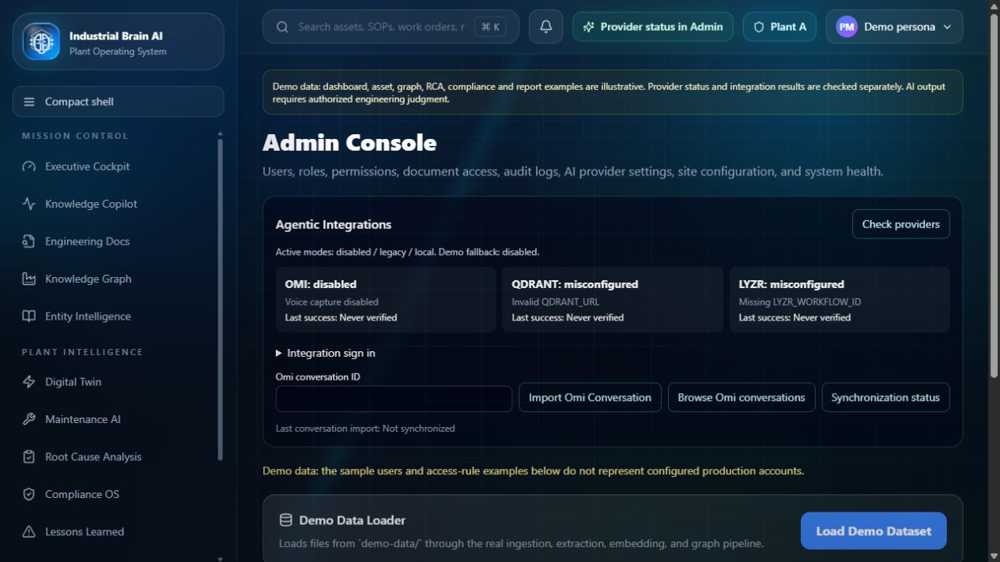

# Verification report — BLOCKED for production

Initial baseline: 2026-09-13. Updated: 2026-09-14. Branch: `feat/omi-qdrant-lyzr-integration`. Baseline: `40584d47904884a4b4349bd4d2de0e00ef0625a0`. Changes remain uncommitted and unpushed. No external resources or production settings were changed.

## Executed locally

| Check | Result |
|---|---|
| Frozen frontend install | Passed |
| Python 3.10 requirements installation and FastAPI startup | Passed |
| Demo evidence packaging | 16 source documents |
| ESLint | Passed, no errors or warnings |
| TypeScript typecheck | Passed |
| Provider/API contract suite | 40 tests passed; external responses mocked |
| Existing evidence tests | Four scenarios passed: empty, uploaded, packaged, corrupt index |
| Judge questions | 14 passed in local extractive demo mode, including all seven requested questions |
| FastEmbed worker tests | Five protocol, secret isolation, validation and failure checks passed |
| Component rendering and axe semantics | Passed; color contrast excluded from jsdom test |
| Next production build | Passed; Next ESLint plugin detection warning remains |
| HTTP regression | All 13 navigation routes returned 200 with main content |
| HTTP guardrails | Passed: unauthenticated integration access 401, unavailable provider 503, hot-work refusal, insufficient evidence, labelled PDF export |
| Legacy FastAPI smoke | Ten read endpoints returned 200 after startup |
| Migration dry run | 352 candidate chunks, zero previously completed documents, legacy unchanged; no vectors indexed |
| Git whitespace check | Passed; Windows line-ending notices only |

The first final HTTP run caught the existing broad proxy intercepting new dynamic Next API handlers. Moving that proxy into fallback rewrites fixed the issue. The rebuilt application passed the complete HTTP script. This regression is now exercised in CI configuration, but remote CI has not run.

## Browser verification

The local production build rendered all 13 major navigation destinations. Desktop DOM checks found no horizontal overflow. P101 Copilot was submitted through the UI and returned four actual demo-source citations, explicit `local fallback`, human review required and uncalibrated confidence. Admin displayed Omi disabled and Qdrant/Lyzr misconfigured, each never verified. No console errors were captured during these navigation and Copilot checks. This is not a comprehensive failed-network trace or authenticated live-provider browser test.

The browser accepted requested 1440/390 viewport overrides but the measured viewport stayed 1280×720 (document client width 1265). That initial mobile attempt was unverified; a later fresh-session check below supersedes it. Screenshots show the actual default desktop browser. Full contrast, keyboard and assistive-technology checks remain outstanding.

## Earlier demo-mode health observations

| Endpoint | HTTP | Observed state |
|---|---|---|
| `/api/health` | 200 | Ready for explicitly selected disabled/legacy/local mode only |
| `/api/health/omi` | 200 | disabled; no successful external probe |
| `/api/health/qdrant` | 503 | misconfigured; missing valid URL |
| `/api/health/lyzr` | 503 | misconfigured; missing workflow ID |
| `/api/readiness` | 200 | Local demo mode requires no external providers; not production readiness |

Mandatory external-provider failure and readiness behavior are covered by mocked contract tests. They have not been verified with real accounts. These observations predate credential verification; see the update below.

## Outstanding acceptance checks

- Reviewed real Omi conversation import, native action metadata and complete provenance workflow. Authenticated Omi reads now pass.
- Qdrant schema/indexing/deletion, resumability, permission isolation and retrieval-quality comparison. Migration remains unapplied. Local FastEmbed inference now passes.
- Six-agent Lyzr orchestration. Direct managerial agent inference and the native no-evidence output mapping now pass; no account-side workflow exists or was created.
- Full live flagship and judge-question E2E, safety and human-review workflow under real roles.
- Docker image build/run: Docker CLI initially could not connect; after starting the installed Desktop app, `docker version` remained unresponsive and was cancelled. Engine availability must be resolved before container verification.
- Comprehensive browser network/accessibility checks, full interactive regression, and all production checks.
- Production persistence and backup/restore; legacy FastAPI security hardening before exposing that backend.
- Organization-approved full-history secret scanning. Credentials supplied later are retained only in an ignored private environment file; none are intended for the repository.
- Remote CI, staging and production deployment, approval gates, verified Render rollback deployment ID.

The existing Render homepage was inspected read-only. It is not this branch and still has previous static claims. No production integration health or flagship execution is verified. Final acceptance remains **BLOCKED**.

## Credential verification update — 2026-09-14

See [live provider checks](LIVE_PROVIDER_CHECKS.md). Omi authenticated read and Lyzr active-agent read/inference succeeded. The application health endpoints returned Omi 200 healthy, Lyzr 200 healthy, Qdrant 503 unavailable, and readiness 503. Qdrant DNS returned NXDOMAIN through local, Google and Cloudflare checks; its key and collection could not be checked. Direct Lyzr inference uses the actual Agent ID and separate session ID, never a fabricated workflow ID. Native output adaptation accepted an actual insufficient-evidence result with zero validated claims.

FastEmbed generated actual finite 384-dimensional vectors locally using BAAI/bge-small-en-v1.5; a related passage outranked an unrelated control. Current automated checks: 40 provider contracts, five FastEmbed worker checks, 14 judge questions, four evidence regression scenarios and component axe semantics passed. Lint/typecheck and Next build passed after the changes. Docker now includes Python/FastEmbed but its build remains unverified. This update does not change the production BLOCKED verdict.

A fresh browser session successfully applied and measured 390×844. All 13 major route titles rendered with no horizontal overflow; the live health panel was checked and captured at that size, with no console errors captured. This resolves the initial viewport-tool limitation, but does not establish full mobile interactive E2E or accessibility compliance.
